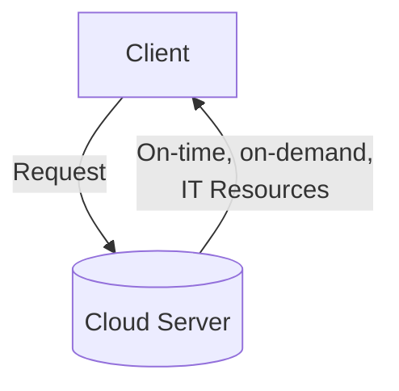

# AWS Cloud Computing notes


 **Client-Server Model**

 ```mermaid
 flowchart TD
  A[Client] --> | Request | B[Server]
  B --> | Response | A
```

## Cloud Computing



### Types of Cloud Computing Deployment Models

- Cloud-based deployment
  - Full applications are migrated and running on the cloud
  - New apps are develope on the cloud
  - Virtual serversm databases, and networking components fully based in the cloud
- On premises deployment (aka Private Cloud)
  - Deployment by virtualization and management tools
- Hybrid Deployment
  - Cloud-based resources connected to on-premises infrastructure
  - Running only certain services on the cloud

## EC2 (Amazon Elastic Computing Cloud)

- Hypervisor
  - Responsible for sharing the underlying physical resources between the virtual machines
- Multitenancy
  - Sharing the physical resources between virtual machines

EC2 virtual machines are isolated from each other; one instance is
not aware of the others on the same host

**Vertically scalling**: scalling on-demand

**EC2 Instante Types**
- Each type is grouped into instance families:
  - General purpose instances
  - Compute optimized instances
    - high-performance servers
    - compute-intensive application servers
    - gaming servers
  - Memory optmized instances
    - fast performance for workloads that process large datasets in memory
  - Accelerated computing instances
    - uses hardware accelerations, or coprocessors, to perform some functions more efficiently
    - used for floating-point number calculations, graphic applications, data pattern matching
  - Storage optimized instances
    - for worloads that require high, sequential read and write access to large datasets on local storage
    - for tens of thousands of low latency, random IOPS (input/output operations per second)

**EC2 Pricing**
- On-demand
  - per hour or per second
  - depends on instance type and chosen infrastructure
- Savings plan
  - dollars/hour and plans of 1 or 3 years
  - depends on instance type and chosen infrastructure
- Reserved instances
  - plans of 1 or 3 years
  - payment can be: all upfront, partial or no upfront
- Spot instances
  - use leftover resources of other instances
  - can be 90% off of on-demand prices
  - depends on EC2 capacity
  - better for worloads that can withstand interruptions
- Dedicated hosts
  - fully dedicated physical servers with EC2 instancces
    that do not share resources with other clients
  - client is able to use existing per-socket, per-core or
    per-VM licenses to mantain compliance if needed
- *There are also on-demand dedicated hosts and dedicated hosts reservations!*

**EC2 Auto Scalling**
- Dynamic scalling responds to changing demand
- Predictive scalling automatically schedules the right number of EC2
instances based on predicted demand


