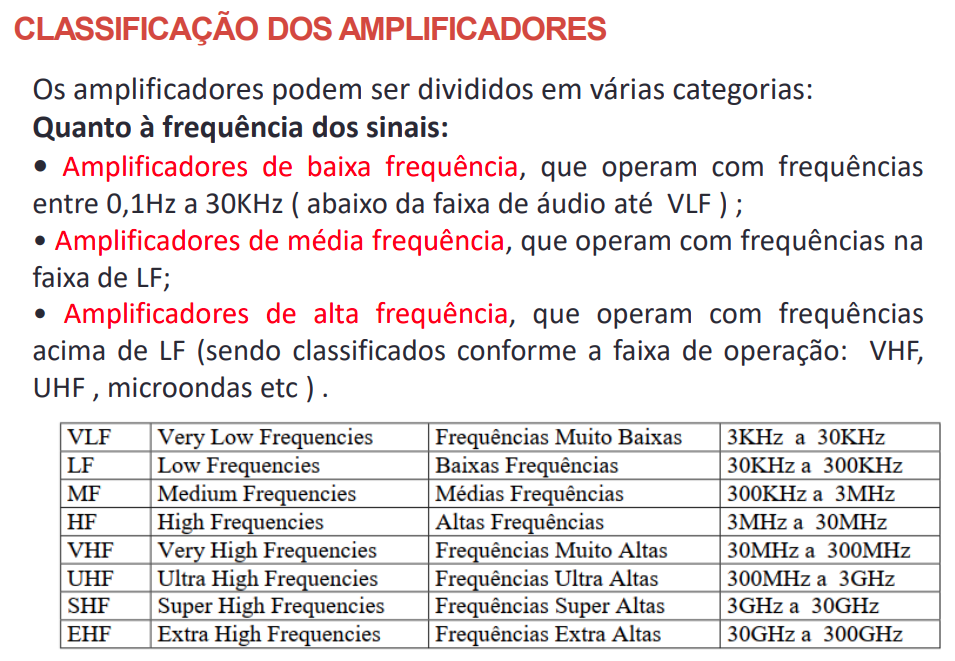

# Electronics

### Equations
*Parallel Resistance*:
$1 / R_{tot} = 1/R1 + 1/R2 ....$

*Voltage Divider*:
$V_{out} = V-{in} \cdot R2 / R1 + R2$ |
Voltage at Middle of divider

*LED Resistor*:
$R = V_s - V_f / I_f$ |
Vs = Source Voltage, Vf = LED Forward Voltage, If = LED desired Current

*Capacitor Parallel*:
$C_{tot} = C1 + C2 + C3....$ |
Total values are additive

*Capacitor Series*:
$C_{tot} = 1/C1 + 1/C2 + 1/C3...$

*Power*:
$P = I^2 \cdot R$

*Ohms Law (Voltage)*:
$V = I \cdot R$

*Ohms Law (Resistance)*:
$R = V / I$

*Ohms Law (Current)*:
$I = V / R$

---
### Sobre amplificadores

#### Pontos importantes e conceitos iniciais

- **Sinal elétrico**: variação de tensão/corrente que carrega _informação_;

- variações aleatórias são consideradas _ruído_;

- a _intensidade_ dos sinais elétricos depende do objetivo da aplicação;

- a transformação desses sinais pode acontecer através da **amplificação**
        do sinal;

- um **amplificador** é um _conjunto_ de componentes e circuitos que efetuam
amplificação do sinal;

- _altos fatores_ de amplificação podem ser atingidos com o uso de multiplos
amplificadores ou _estágios amplificadores_, que trabalham de forma **sucessiva**;

- a _qualidade_ do sinal pode cair ao longo do processo de amplificação;
como _filtros_, podem e são utilizados para reduzir essas quedas na
do sinal;

- amplificadores:
        - pequeno sinal ($\mu V$ to $mV$)
        - média potência (centenas de $mV$, $I_C$ em $mA$, $P_C$ em centenas
        de $mW$
        - etc.
> 

- o **transistor** utilizado é o principal determinante das frequências e níveis
        de uso do amplificador;

- tipos de _estágios amplificadores_:
        - tensão de instrumentação;
        - corrente;
        - potencia;

- estágios _pré amplificadores_: vem antes do último **amp de potência**;

- **casar impedância**: combinar a impedância com a resistência (?) =pesquisar=

- frequências harmônicas são frequências múltimas da _frequência fundamental_;

- são parâmetros de estágio do amplificador:
        - ganho de tensão;
        - ganho de corrente;
        - impedância de entrada;
        - impedância de saída;

### Pesquisar e acrescentar ao texto
- [ ] casar impedância
- [ ] Thevenín e Norton
- [ ] teorema de transferência de potência
- [ ] recompor sinal periódico em senoidais
- [ ] Teorema de Fourier
- [ ] buffers
- [ ] RF
- [ ] configurações de amplificadores e suas equações

