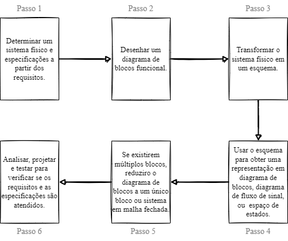

# Modelagem de Sistemas

### Relações

| Sistema  | Resistências       | Capacitâncias                       | Indutâncias                   |
| -------- | ------------------ | ----------------------------------- | ----------------------------- |
| Elétrico | $E = Ri$           | $E=\frac{1}{C}\int idt$             | $E=L\frac{di}{dt}$            |
| ---      | ---                | $\frac{1}{\Delta C}$                | $\Delta L$                    |
| Mecânico | $F = B\dot{x}$     | $F = -k_s x$                        | ---                           |
| Fluídico | $\Delta P = R_f Q$ | $\Delta P =\frac{1}{C_1}\int Q dt$  | $\Delta P = I_i\frac{dQ}{dt}$ |
| Térmico  | $\Delta T = R_t q$ | $\Delta T = \frac{1}{C_1}\int q dt$ | ---                           |
|          |                    |                                     |                               |

---

## Definições Iniciais

**Transdutor**: dispositivo de conversão de energia de uma natureza
para outra, e.g. microfone, termômetro, etc.

Problemas em modelagem de sistemas podem ser classificados em três tipos:

1. Problemas de **Análise**: _saída_ $S$ desconhecida,
_entrada_ $E$ e _sistema_ $Si$ conhecidos;

2. Problemas de **Síntese**: $E$ e $S$ conhecidas, $Si$ a ser
determinado;

3. Problemas de **Medidas**: $Si$ e $S$ conhecidos, $E$ desconhecido ou medido de forma imperfeita ($S$ com distorções).

Tipos de sistemas:
- **Sistema em malha aberta:** não pode realizar compensações para
quaisquer perturbações (que apareçam tanto na entrada quanto na saída);
são comandados unicamente pela entrada.
- **Sistema em malha fechada:** compensa o efeito das perturbações;
apresenta mais precisão que sistemas em malha aberta;
maior complexidade; também conhecidos como sistemas de
_controle com realimentação_.

**Erro ou sinal de atuação:** sinal de saída subraído do sinal de entrada.
**Resposta transistória:** período de tempo que decorre logo após a
aplicação de uma nova entrada ao sistema, no momento em que se dão
grandes variações na saída do processo.
**Resposta em regime permanente:** se assemelha à entrada; é o que,
normalmente, permanece quando a resposta transistória decai a zero.

$$\text{resposta total}^{[3]}=\text{resposta natural}^{[1]}
+\text{resposta forçada}^{[2]}$$

**[1]** Descreve o modo como o sistema dissipa ou obtém energia. Depende
apenas do sistema. _Tende a 0 ou oscila_.
**[2]** Depende da entrada;
**[3]** A resposta transistória também equivale à soma entre natural
e forçada enquanto a total é muito grande.

**Figura 1 Processo de projeto de sistema de controle:**

## Mechanical Systems
### Elements of mechanical systems:
- **Mass**
- **Inertia**
> $$\sum{F=ma} \rightarrow f(x)=m\cdot \ddot{x}$$ or
> $$f(x)=m\frac{d^2 x}{dt^2}$$
> For the torque function, for $\theta =$ angular position and $J=$ moment of inertia:
> $$\sum\tau = J \alpha \rightarrow \tau(t)=J\ddot{\theta}$$
> > ![[model_fig_002_element.png]]

- **Springs**
> For a linear spring, with $k=$ stiffness constant, attached to
> a fixed reference at an $x$ position:
> $$f(t)=kx$$
> For rotating spring, with $k=$ stiffness constant, $\theta=$ angular position:
> $$\tau(t)=k(\theta_2 -\theta_1)$$
> > ![[model_fig_003_element.png]]
>
> For a spring with neither side attached to a fixed reference, the forces:
> on both ends must be _equal in magnitude and opposite in direction_ so that the
> net force equals zero, else, the acceleration would be infinite.
> $$f = k(x_1 - x_2)$$
> Considering *springs parallel to each other*, the equivalent stiffness constant will be = $$k_{eq}=(k_1+k_2)$$
> For *springs in series*, we consider the load on each spring to be the same, $k_1y=F$ (1) and $k_2(x-y)=F$, therefore, it works like parallel resistors would: $$k_{eq}=\frac{1}{\frac{1}{k_1}+\frac{1}{k_2}}$$ ![[Pasted image 20230907151305.png]]
- **Viscous Dampers**
> Viscous dampers depend on the speed of both ends, with $b$ as the viscous constant:
> $$f(t)=b(\dot{x}_2 - \dot{x}_1)$$
> $$\tau(t)=b(\dot{\theta}_2-\dot{\theta}_1)$$
> > ![[model_fig_004_element.png]]
> Considering *dampers parallel to each other*, the equivalent stiffness constant will be = $$b_{eq}=(b_1+b_2)$$
>
> For *dampers in series*, we consider the load on each spring to be the same, $b_1\dot{y}=F$ (1) and $b_2(\dot{x}-\dot{y})=F$, therefore, it works like parallel resistors would: $$b_{eq}=\frac{1}{\frac{1}{b_1}+\frac{1}{b_2}}$$

#### Example

![[model_fig_005_example.png]]

Definitions:
$x=$ displacement; $\dot{x}=$ speed; $\ddot{x}=$ acceleration
$\sum{F=m\ddot{x}}$
Considering down to be $+\downarrow$ positive:
$$F(t)-b\dot{x}-k{x}=m\ddot{x}$$
Given that
$F(t) =$ force downwards on the mass
$-b\dot{x}=$ viscous damper force
$-kx=$ spring force
$m\ddot{x}=$ the  sum of the forces given by Newton's law

## Electrical Systems
### Elements of Electrical Systems
- Resistors
	- no inductance or capacitance
	- voltage drop: $v = v_1 - v_2 = RI$
- Capacitors
	- no resistance or inductance
	- $v = v_1 - v_2 = \frac{1}{C}\int{idt}\rightarrow i=C{(\frac{dv}{dt})}$
- Inductors

	- no resistance or capacitance
	- $v = v_1 - v_2 = L\frac{di}{dt} \rightarrow i = \frac{1}{L}\int{vdt}$

![[model_fig_006_element.png]]

![[model_fig_007_comparison.png]]
![[model_fig_008_analogy.png]]

## [[Laplace Transform]]

What is a [[Laplace Transform]]?
> The [[Laplace Transform]] takes a function of time off of the _time domain_;
> and it takes it to an _s domain_, so that it's easier to solve and
> that result can be brought back to the time domain.
> $$F(s)=\int_0^\infty e^{-st}f(t)dt$$
> or
> $$F(s) = \mathcal{L}[F(t)]$$

Improper [[Integrals]]

> $$F(s)=\int_0^\infty e^{-st}f(t)dt\Rightarrow \lim_{h\to\infty}
[\int_0^h e^{-st}f(t)dt]$$

## Transfer Functions

> Transfer function is the ratio of the Laplace Transform of the _output_ to the
Laplace Transform of the _input_, given that **all the initial conditions are assumed
to be zero** (otherwise the system will not be linear). - Neso Academy
>
> $$y(t) = x(t)*h(t)$$
>
> $$Y(s)=X(s)\cdot H(s)$$
>
> $$H(x)=\frac{Y(s)}{X(s)}$$
> ![[model_fig_009_neso.png]]

_"How does a given input affects a given output?"_

A TF (transfer function) is a input/output model describing how a given
input affects a given output. - [Christopher Lum](https://www.youtube.com/watch?v=Uh_-RZQIaEs&ab_channel=ChristopherLum)

## Problemas resolvidos:
1. Sistema massa, mola e amortecedor:
![[Pasted image 20230816171731.png]]

Passo 1: diagrama de corpo livre (FBD)
![[Pasted image 20230816172248.png]]

Passo 2: segunda lei de Newton
$$\sum F = m\ddot{x}$$
$\sum F = f-kx-b\dot{x}=m\ddot{x}$, isolando f, temos que $f=m\ddot{x}+b\dot{x}+kx$

Passo 3: teorema da derivação real
- $\mathcal{L} [\ddot{x}(t)]=s^2X(s)-sx(0)-x(0)$

considerando as condições iniciais nulas ($sx(0)$ e $x(0)$ iguais a 0), temos que
$$ms^2X(s)+bsX(s)+kX(s)=F(s)$$
que pode ser reduzido a
$$X(s)[ms^2+bs+k]=F(s)$$

## Regra de Crammer

Dado um sistema 2x2:
$$
\begin{bmatrix}
	a & b \\
	c & d
	\end{bmatrix}
	\begin{bmatrix}
	x \\
	y \\
	\end{bmatrix}
	=
	\begin{bmatrix}
	 e \\
	 f \\
	\end{bmatrix}
$$

A regra de Crammer é tal que:

$$
x = \frac{
\begin{vmatrix}
	\textcolor{red}{e} & b \\
	\textcolor{red}{f} & d \\
	\end{vmatrix}
}{
\begin{vmatrix}
	a & b \\
	c & d
	\end{vmatrix} } = \frac{e\cdot d - f\cdot b}{a\cdot d - c \cdot b}
$$

## Solving Problems

1. No sistema mecânico abaixo, temos um carro de massa desprezível e um sistema massa-mola-amortecedor. u é o deslocamento do carro e a entrada do sistema. O carro se move a uma velocidade constante (du/dt = constante). O deslocamento y da massa é a saída. A massa do sistema é m, a constante elástica da mola é k e o coeficiente de atrito viscoso do amortecedor é b. Obtenha o modelo matemático do sistema.
![[singlecartp.png]]

Solution:
$$
\begin{matrix}
m\ddot{y} = -k(y-u) - b(\dot{y}-\dot{u})
\\
m\ddot{y} + b\dot{y} + ky = b\dot{u} + ku
\\
ms^2Y + bsY + kY = bsU + kU
\\
Y(ms^2+ bs + k) = U(bs + k)
\\
\frac{Y}{U}=\Large{\frac{bs+k}{ms^2+bs+k}}
\end{matrix}
$$

2. Obtenha o modelo matemático e a função de transferência X1(s)/U(s) para o sistema mecânico abaixo. x1 e x2 são deslocamentos e u é a força de entrada. As massas do sistema são m1 e m2, as constantes elásticas das molas são k1, k2 e k3, e o coeficiente de atrito viscoso do amortecedor é b.

![[two_cart.png]]

Solution:

$$
\begin{matrix}
m_1\ddot{x} = -k_1x_1 -k_2(x_1 - x_2) - b(\dot{x}_1 - \dot{x}_2) + u
\\
m_2 \ddot{x} = -k_3x_2 -k_2(x_2 - x_1) - b(\dot{x}_2 - \dot{x}_1) 
\\
m_1s^2X_1 = -k_1X_1 - k_2X_1 + k_2X_2 - bsX_1 + bsX_2 + U
\\
m_1s^2X_1 = -k_3X_2 - k_2X_2 + k_2X_1 - bsX_2 + bsX_1
\\
\\
X_1(m_1s^2 + k_1 + k_2 + bs) = X_2(k_2 + bs) + U
\\
X_2(m_2s^2 + k_3 + k_2 + bs) = X_1(k_2 + bs)
\\
\\
A_1 = (m_1s^2 + k_1 + k_2 + bs)
\\ 
A_2 = (m_2s^2 + k_3 + k_2 + bs)
\\
\\ \text{equation system}
\\
B = (k_2 + bs)
\\
X_1A_1 = X_2B + U
\\
X_2A_2 = X_1B
\\
\\
X_2 = \frac{X_1B}{A_2} \rightarrow X_1A_1 = \frac{X_1B}{A_2}B+U
\\
X_1 A_1 =\frac{X_1B^2}{A_2} + U
\\
X_1(A_1 - \frac{B}{A_2}) = U
\\
\frac{X_1}{U}=\frac{1}{A_1-\frac{B^2}{A_2}}
\\
\\
\frac{X_1}{U}=\Large{\frac{1}{(m_1s^2 + k_1 + k_2 + bs)-\frac{(k_2 + bs)^2}{(m_2s^2 + k_3 + k_2 + bs)}}}

\end{matrix}
$$

